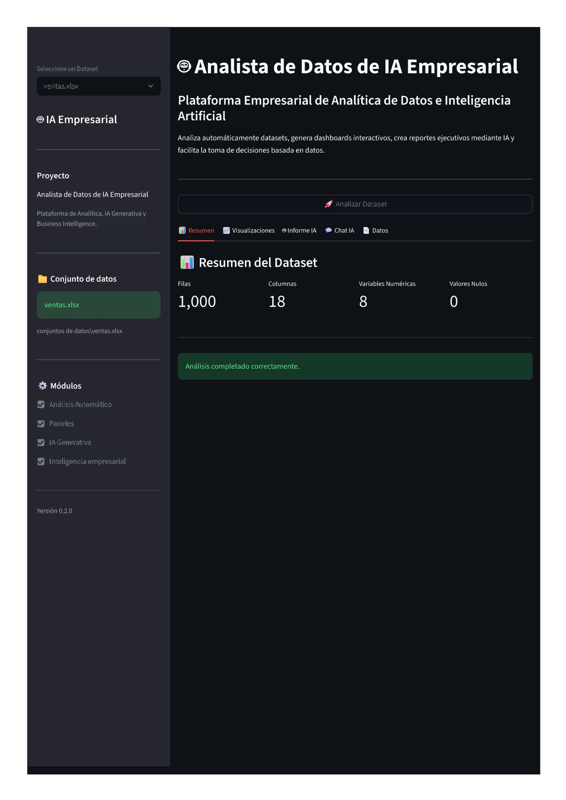
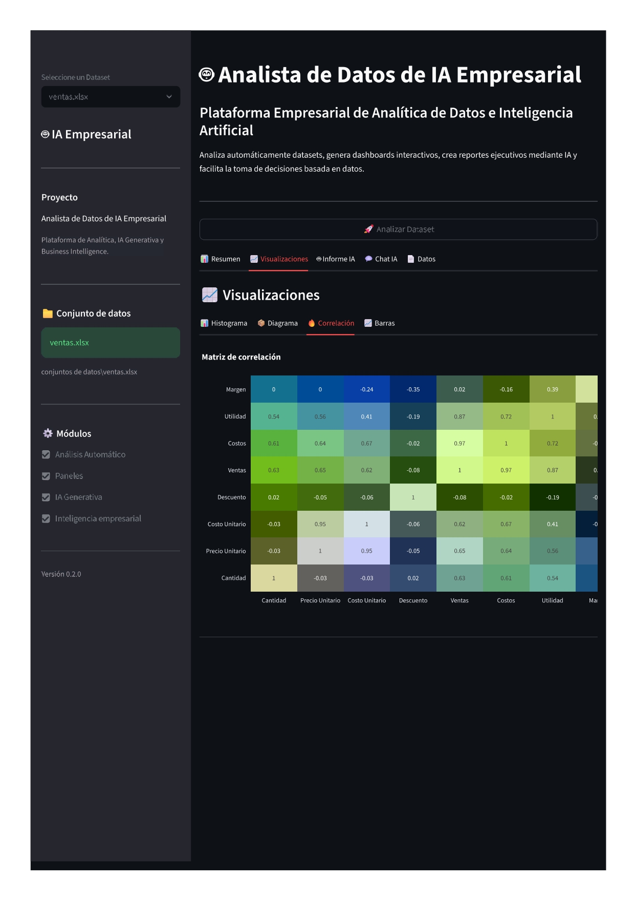
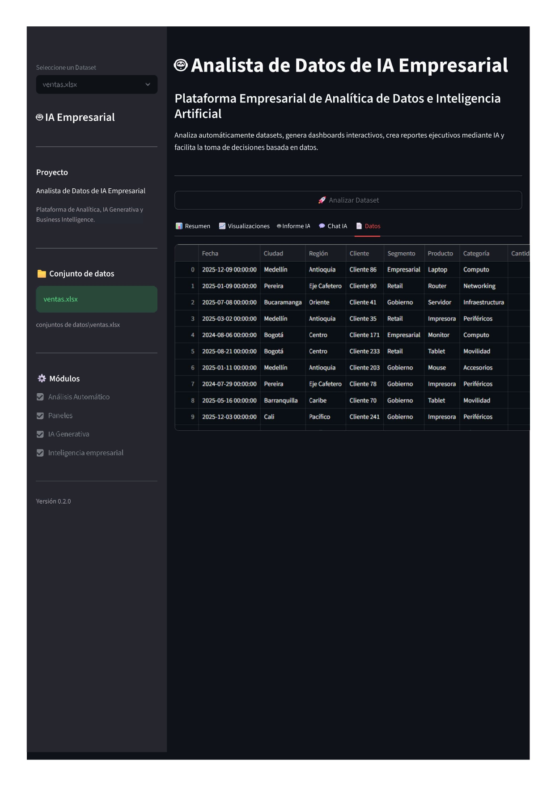

# 🚀 Enterprise AI Data Analyst

> **Plataforma Empresarial de Inteligencia Artificial para el análisis automatizado de datos, analítica conversacional, Business Intelligence y generación de conocimiento mediante IA.**


---

# 📑 Índice

- 📌 Descripción
- 🎯 Visión del Proyecto
- 🏗 Arquitectura General
- 🧠 Enterprise Reasoning Engine
- ⚡ Enterprise Token Optimizer
- 📊 Funcionalidades Actuales
- 💬 Chat Inteligente con los Datos
- 📈 Dashboard Interactivo
- 📄 Informes Ejecutivos
- 🛠 Tecnologías Utilizadas
- 🚀 Instalación
- 📂 Estructura del Proyecto
- 🛣 Roadmap
- 👨‍💻 Autor

---

# 📌 Descripción

**Enterprise AI Data Analyst** es una plataforma empresarial de Inteligencia Artificial diseñada para transformar cualquier conjunto de datos en conocimiento útil para la toma de decisiones.

A diferencia de un chatbot tradicional, la plataforma incorpora un **motor propio de razonamiento empresarial**, optimización inteligente del contexto, compresión semántica de información y generación de respuestas estructuradas.

Su objetivo es asistir a analistas, gerentes y organizaciones en la interpretación de datos mediante lenguaje natural, permitiendo obtener análisis profesionales en segundos.

Actualmente la plataforma integra:

- 📊 Ciencia de Datos
- 🤖 Inteligencia Artificial Generativa
- 📈 Business Intelligence
- 💬 Analítica Conversacional
- 🧠 Enterprise Reasoning Engine
- ⚡ Enterprise Token Optimizer
- 📚 Gestión Inteligente del Contexto
- 🗂 Knowledge Base Empresarial
- 🧠 Memoria Conversacional
- 📄 Generación Automática de Informes

### Vista general de la plataforma

La siguiente imagen resume las principales capacidades de **Enterprise AI Data Analyst**, mostrando la integración entre análisis inteligente, visualizaciones, informes ejecutivos y conversación con los datos.

<p align="center">
    
</p>

> **Nota:** A lo largo de este documento se muestran capturas específicas del Dashboard, Chat Inteligente, Informes Automáticos y Análisis de Datos para ilustrar cada módulo de la plataforma.

---

# 🎯 Visión del Proyecto

Enterprise AI Data Analyst nace con una visión clara:

> **Democratizar el análisis avanzado de datos mediante Inteligencia Artificial.**

Tradicionalmente, obtener un análisis empresarial completo requería la participación de varios especialistas:

- Analistas de Datos
- Científicos de Datos
- Analistas de Negocio
- Especialistas en Business Intelligence
- Ingenieros de Machine Learning

Además de herramientas independientes para:

- Limpieza de datos
- Estadística
- Visualización
- Machine Learning
- Generación de reportes
- Consultas empresariales

La propuesta de Enterprise AI Data Analyst consiste en integrar todo este ecosistema dentro de una única plataforma inteligente capaz de comprender los datos, razonar sobre ellos y generar conocimiento accionable para apoyar la toma de decisiones.

El objetivo no es reemplazar al analista de datos, sino potenciar sus capacidades mediante la automatización de tareas repetitivas y el uso de razonamiento asistido por Inteligencia Artificial.

---

# 🏗 Arquitectura General

La solución está diseñada bajo una arquitectura modular, desacoplada y escalable, permitiendo incorporar nuevas capacidades de IA sin afectar los componentes existentes.

Cada módulo posee una responsabilidad específica, facilitando el mantenimiento, la evolución del sistema y la futura integración de agentes inteligentes especializados.

```

Enterprise_AI_Data_Analyst/

├── agents/
├── api/
├── artifacts/
├── automl/
├── chat/
├── core/
├── dashboard/
├── database/
├── docs/
├── logs/
├── memory/
├── models/
├── projects/
├── rag/
├── reports/
├── tests/
├── uploads/
└── utils/

```

La arquitectura actual ya incorpora un conjunto de motores especializados responsables del análisis empresarial, el razonamiento, la optimización del contexto, la gestión del conocimiento y el control inteligente del consumo de tokens.

---

# 🧠 Enterprise Reasoning Engine

Uno de los principales diferenciales de **Enterprise AI Data Analyst** es la incorporación de un motor propio de razonamiento empresarial.

En lugar de enviar directamente una pregunta al modelo de lenguaje, la plataforma construye un proceso de razonamiento estructurado que guía a la IA antes de generar la respuesta.

Actualmente el motor puede adaptar automáticamente su profundidad de razonamiento según el tipo de consulta.

## Pipeline de razonamiento

### 🔹 Consultas rápidas

```
Observación
```

Se utiliza para preguntas simples como:

- ¿Cuántas filas tiene el dataset?
- ¿Cuál es el promedio de Utilidad?
- ¿Qué columnas existen?

---

### 🔹 Resúmenes ejecutivos

```
Observación
        ↓
Patrones
```

Permite construir resúmenes compactos del conjunto de datos.

---

### 🔹 Análisis empresariales

```
Observación
        ↓
Patrones
        ↓
Hipótesis
        ↓
Validación
        ↓
Impacto
        ↓
Riesgos
        ↓
Acciones
```

Este pipeline permite que la IA:

- Identifique patrones.
- Detecte anomalías.
- Valide hipótesis.
- Evalúe riesgos.
- Estime impactos.
- Genere recomendaciones accionables.

---

### 🔹 Informes ejecutivos

```
Observación
        ↓
Patrones
        ↓
Hipótesis
        ↓
Validación
        ↓
Impacto
        ↓
Riesgos
        ↓
Acciones
        ↓
KPIs
```

Es el modo más completo de razonamiento disponible actualmente.

---

# ⚡ Enterprise Token Optimizer

Uno de los principales retos de los modelos de lenguaje es el consumo de tokens.

Para resolver este problema se desarrolló un sistema propio de optimización de contexto.

El sistema analiza automáticamente:

- Tipo de pregunta.
- Variables relevantes.
- Estadísticas necesarias.
- Contexto histórico.
- Memoria conversacional.
- Conocimiento empresarial.

Posteriormente elimina toda la información innecesaria antes de consultar el modelo de IA.

Gracias a este proceso se obtiene un equilibrio entre:

- Calidad de la respuesta.
- Velocidad.
- Consumo de tokens.
- Costos de inferencia.

## Beneficios obtenidos

Actualmente el sistema consigue aproximadamente:

| Optimización | Resultado |
|--------------|----------:|
| Reducción del contexto enviado al LLM | **80–86 %** |
| Menor tiempo de respuesta | ✅ |
| Menor costo por consulta | ✅ |
| Mayor escalabilidad | ✅ |

Este mecanismo permite generar análisis extensos utilizando únicamente el contexto estrictamente necesario.

---

# 📊 Funcionalidades actuales

Actualmente la plataforma incorpora los siguientes módulos funcionales:

## ✔ Gestión inteligente del contexto

- Context Builder
- Semantic Context Selector
- Context Compressor

## ✔ Motor de razonamiento empresarial

- Prompt Router
- Enterprise Reasoning Engine
- Reasoning Templates
- Response Controller

## ✔ Gestión del conocimiento

- Knowledge Base
- Knowledge Insights

## ✔ Memoria

- Conversation Memory

## ✔ Perfilado del dataset

- Dataset Profiler
- Statistics Engine
- Recommendation Engine

## ✔ Chat Inteligente

- Preguntas en lenguaje natural
- Análisis automáticos
- Estadísticas
- Recomendaciones empresariales

## ✔ Visualización

- Dashboard
- Plotly
- KPIs
- Estadísticas

## ✔ Reportes IA

- Informes ejecutivos
- Resúmenes automáticos
- Hallazgos
- Recomendaciones

---

# 🛣 Estado del desarrollo

| Módulo | Estado |
|--------|:------:|
| Core | ✅ |
| Chat Inteligente | ✅ |
| Enterprise Reasoning Engine | ✅ |
| Enterprise Token Optimizer | ✅ |
| Context Builder | ✅ |
| Knowledge Base | ✅ |
| Conversation Memory | ✅ |
| Dashboard | ✅ |
| Reportes IA | ✅ |
| AutoML | 🚧 |
| Multiagentes | 🚧 |
| RAG Empresarial | 🚧 |

---
# 💬 Chat Inteligente con los Datos

Una de las principales capacidades de **Enterprise AI Data Analyst** es permitir que cualquier usuario pueda conversar con sus datos utilizando lenguaje natural.

No es necesario escribir consultas SQL ni conocer Python.

La plataforma interpreta la intención de la pregunta, selecciona automáticamente el contexto relevante, aplica el **Enterprise Reasoning Engine** y genera una respuesta estructurada basada únicamente en la información del dataset.

---

## ¿Qué puede responder?

Actualmente el asistente puede responder preguntas como:

### 📊 Estadísticas

- ¿Cuántas filas tiene el dataset?
- ¿Cuántas columnas existen?
- ¿Cuál es el promedio de Utilidad?
- ¿Cuál es el máximo de Margen?
- ¿Cuál es el mínimo de Ventas?
- ¿Qué variables numéricas existen?

---

### 📈 Análisis Empresarial

- Analiza este dataset.
- Identifica riesgos.
- Detecta oportunidades de mejora.
- ¿Qué variables afectan más la rentabilidad?
- Resume este análisis para la gerencia.
- Dame recomendaciones para mejorar el negocio.

---

### 📄 Informes Ejecutivos

La plataforma puede generar automáticamente:

- Resumen Ejecutivo.
- Hallazgos.
- Patrones detectados.
- Riesgos.
- Oportunidades.
- Recomendaciones.
- Conclusiones.

Todo utilizando el contexto disponible y evitando inventar información.

---

# 🧠 Ejemplos de conversación

### Consulta rápida

**👤 Usuario**

> ¿Cuál es el máximo de Margen?

**🤖 Enterprise AI**

> El valor máximo de **Margen** es **54.33%**.

---

### Consulta analítica

**👤 Usuario**

> Analiza este dataset y dame recomendaciones.

**🤖 Enterprise AI**

La plataforma genera automáticamente un informe estructurado que incluye:

- Resumen Ejecutivo.
- Hallazgos principales.
- Patrones detectados.
- Riesgos.
- Oportunidades.
- Recomendaciones accionables.
- Conclusiones.

El nivel de profundidad depende del tipo de pregunta y es decidido automáticamente por el **Enterprise Reasoning Engine**.

---

## Ejemplos reales del Chat Inteligente

### Consulta 1

<p align="center">
    
</p>

---

### Consulta 2

<p align="center">
    
</p>

---

### Consulta 3

<p align="center">
    
</p>

---

# 🧠 Cómo responde la IA

Antes de generar una respuesta, el sistema ejecuta automáticamente varias etapas:

```

Pregunta del usuario
↓
Intent Router
↓
Prompt Router
↓
Context Builder
↓
Semantic Context Selector
↓
Context Compressor
↓
Enterprise Reasoning Engine
↓
Gemini
↓
Response Controller
↓
Respuesta Final

```

Este proceso permite:

- Reducir significativamente el consumo de tokens.
- Mantener respuestas coherentes.
- Evitar alucinaciones.
- Priorizar únicamente el contexto relevante.
- Adaptar automáticamente la profundidad del razonamiento.

---

## Beneficios para el usuario

Con esta arquitectura el usuario puede obtener respuestas profesionales sin necesidad de conocimientos técnicos.

Entre sus principales ventajas se encuentran:

- 💬 Conversación en lenguaje natural.
- 📊 Interpretación automática del dataset.
- 📈 Análisis empresariales completos.
- 📄 Informes ejecutivos.
- ⚡ Respuestas optimizadas.
- 🧠 Razonamiento empresarial estructurado.
- 💰 Menor consumo de tokens.
- 🚀 Mayor velocidad de respuesta.

---
# 📊 Dashboard Inteligente

Enterprise AI Data Analyst no solo responde preguntas; también transforma automáticamente los datos en información visual que facilita la toma de decisiones.

El sistema genera dashboards dinámicos que permiten comprender rápidamente el comportamiento del negocio, detectar anomalías y descubrir oportunidades.

Actualmente el Dashboard incorpora:

- 📈 KPIs automáticos.
- 📊 Estadísticas descriptivas.
- 📉 Distribuciones de variables.
- 📌 Indicadores empresariales.
- 📍 Perfilado automático del dataset.
- 📊 Visualizaciones interactivas con Plotly.
- 📋 Exploración automática de los datos.

### Dashboard y visualizaciones

<p align="center">
    
</p>

El Dashboard se adapta automáticamente al conjunto de datos cargado, permitiendo obtener una visión general antes de iniciar el análisis conversacional.

---

# 📈 Análisis Inteligente del Dataset

Antes de consultar la Inteligencia Artificial, la plataforma ejecuta un análisis automático del conjunto de datos.

Entre las tareas realizadas se encuentran:

## Perfilado del Dataset

- Número de registros.
- Número de columnas.
- Tipos de datos.
- Valores faltantes.
- Variables numéricas.
- Variables categóricas.

## Estadísticas descriptivas

- Promedio.
- Mediana.
- Moda.
- Mínimo.
- Máximo.
- Desviación estándar.

## Calidad de datos

- Valores nulos.
- Valores duplicados.
- Variables constantes.
- Distribuciones.

## Información empresarial

- Variables críticas.
- Variables financieras.
- Variables de negocio.
- Variables relevantes para la IA.

### Ejemplo del análisis automático

<p align="center">
    
</p>

Este análisis constituye la base del contexto utilizado posteriormente por el Enterprise Reasoning Engine.

---

# 📄 Informes Ejecutivos Generados por IA

Una de las principales capacidades de la plataforma consiste en transformar un análisis técnico en un informe empresarial comprensible para la alta dirección.

Los informes generados automáticamente incluyen:

## Resumen Ejecutivo

Descripción general del comportamiento del negocio.

## Hallazgos principales

Identificación de los patrones más relevantes encontrados por la IA.

## Patrones detectados

Relaciones, tendencias y comportamientos observados.

## Riesgos

Problemas potenciales identificados automáticamente.

## Oportunidades

Áreas donde la organización puede mejorar su desempeño.

## Recomendaciones

Acciones concretas priorizadas según el impacto esperado.

## Conclusiones

Resumen final orientado a la toma de decisiones.

### Ejemplo de informe generado por IA

<p align="center">
    
</p>

Los informes son construidos utilizando el Enterprise Reasoning Engine y únicamente emplean el contexto disponible del dataset, evitando generar información no sustentada.

---

# 📌 Casos de uso

La plataforma puede utilizarse en múltiples escenarios empresariales:

### Comercial

- Análisis de ventas.
- Rentabilidad.
- Clientes.
- Productos.

### Financiero

- Costos.
- Utilidades.
- Márgenes.
- KPIs financieros.

### Operaciones

- Productividad.
- Procesos.
- Calidad.
- Optimización.

### Recursos Humanos

- Rotación.
- Desempeño.
- Ausentismo.

### Marketing

- Campañas.
- Conversión.
- Segmentación.

### Dirección

- Reportes ejecutivos.
- Indicadores.
- Apoyo a la toma de decisiones.

---

# 🚀 Beneficios para las organizaciones

Enterprise AI Data Analyst permite:

- Reducir tiempos de análisis.
- Disminuir el consumo de tokens mediante optimización inteligente.
- Obtener análisis profesionales en segundos.
- Generar conocimiento empresarial automáticamente.
- Facilitar la toma de decisiones basada en datos.
- Democratizar el acceso a la Inteligencia Artificial para usuarios no técnicos.

---
# 🛠 Tecnologías Utilizadas

## Inteligencia Artificial

- Google Gemini 2.5 Flash
- Google Generative AI SDK

## Ciencia de Datos

- Pandas
- NumPy

## Visualización

- Plotly
- Streamlit
- Matplotlib

## Arquitectura IA

- Enterprise Reasoning Engine
- Prompt Router
- Context Builder
- Semantic Context Selector
- Context Compressor
- Knowledge Base
- Conversation Memory

## Backend

- Python 3.11+

## Calidad de Código

- Logging centralizado
- Arquitectura modular
- Programación orientada a objetos

---

# 🚀 Instalación

## 1. Clonar el repositorio

```bash
git clone https://github.com/arteduro/Enterprise_AI_Data_Analyst.git
```

## 2. Ingresar al proyecto

```bash
cd Enterprise_AI_Data_Analyst
```

## 3. Crear entorno virtual

Windows

```bash
python -m venv .venv
```

Activar

```bash
.venv\Scripts\activate
```

Linux / Mac

```bash
python3 -m venv .venv
source .venv/bin/activate
```

---

## 4. Instalar dependencias

```bash
pip install -r requirements.txt
```

---

## 5. Configurar variables de entorno

Crear el archivo:

```
.env
```

Ejemplo:

```text
GEMINI_API_KEY=TU_API_KEY
GEMINI_MODEL=gemini-2.5-flash
TEMPERATURE=0.2
MAX_OUTPUT_TOKENS=6000
```

---

## 6. Ejecutar la aplicación

```bash
streamlit run app.py
```

o

```bash
python app.py
```

(según la versión de la interfaz utilizada).

---

# 📂 Estructura actual del proyecto

```
Enterprise_AI_Data_Analyst/

├── agents/
├── api/
├── artifacts/
├── automl/
├── chat/
├── core/
│   ├── ai/
│   ├── analysis/
│   ├── application/
│   ├── business/
│   ├── cache/
│   ├── context/
│   ├── engines/
│   ├── knowledge/
│   ├── memory/
│   ├── monitoring/
│   ├── prompt/
│   ├── prompts/
│   ├── reasoning/
│   ├── response/
│   ├── routing/
│   └── services/
├── dashboard/
├── database/
├── docs/
├── logs/
├── memory/
├── models/
├── projects/
├── rag/
├── reports/
├── tests/
├── uploads/
└── utils/
```

---

# 📌 Estado actual del proyecto

## Versión

```
v0.2.x
```

## Estado

```
🟢 Desarrollo activo
```

---

## Componentes implementados

- ✅ Enterprise Reasoning Engine
- ✅ Enterprise Token Optimizer
- ✅ Prompt Router
- ✅ Intent Router
- ✅ Context Builder
- ✅ Semantic Context Selector
- ✅ Context Compressor
- ✅ Knowledge Base
- ✅ Conversation Memory
- ✅ Dashboard
- ✅ Chat Inteligente
- ✅ Reportes IA
- ✅ Perfilado automático del Dataset

---

## Componentes en desarrollo

- 🚧 AutoML
- 🚧 RAG Empresarial
- 🚧 Arquitectura Multiagente
- 🚧 API REST
- 🚧 Modelos Predictivos
- 🚧 Explainable AI (XAI)

---

# 🛣 Roadmap

## ✅ v0.1

Infraestructura base

- Core
- Logger
- Base de datos
- Pipeline
- Gestión de proyectos

---

## ✅ v0.2

Enterprise AI

- Chat Inteligente
- Dashboard
- Context Builder
- Prompt Router
- Enterprise Reasoning Engine
- Enterprise Token Optimizer
- Knowledge Base
- Conversation Memory

---

## 🚧 v0.3

Machine Learning

- Entrenamiento automático
- Modelos predictivos
- Comparación de modelos

---

## 🚧 v0.4

RAG Empresarial

- Embeddings
- Base vectorial
- Recuperación semántica

---

## 🚧 v0.5

Arquitectura Multiagente

- Agente Analista
- Agente Estadístico
- Agente de Negocio
- Agente Predictivo

---

## 🚧 v1.0

Primera versión Enterprise

- Plataforma completa
- API
- AutoML
- Explainable AI
- Multiagentes
- RAG
- Dashboards Empresariales

---

# 🤝 Contribuciones

Las contribuciones son bienvenidas.

Si deseas colaborar:

1. Haz un Fork.
2. Crea una rama nueva.

```bash
git checkout -b feature/nueva-funcionalidad
```

3. Realiza tus cambios.

4. Ejecuta las pruebas.

5. Envía un Pull Request.

---

# 👨‍💻 Autor

## Edgar Arteaga Durán

Ingeniero de Sistemas

Especialidades

- Ciencia de Datos
- Inteligencia Artificial
- Machine Learning
- Desarrollo Web
- Business Intelligence
- Ciberseguridad

GitHub

https://github.com/arteduro

LinkedIn

https://www.linkedin.com/in/edgar-arteaga-dur%C3%A1n-72a424117/

---

# 📜 Licencia

Este proyecto se distribuye bajo la licencia **MIT**.

Consulta el archivo:

```
LICENSE
```

---

# ⭐ Filosofía del Proyecto

> **"La Inteligencia Artificial no reemplaza al analista de datos; amplifica sus capacidades, automatiza el trabajo repetitivo y permite que las personas concentren su talento en el análisis estratégico y la toma de decisiones."**

---

# 🚀 Enterprise AI Data Analyst

### Transformando datos en decisiones inteligentes mediante Inteligencia Artificial Empresarial.
